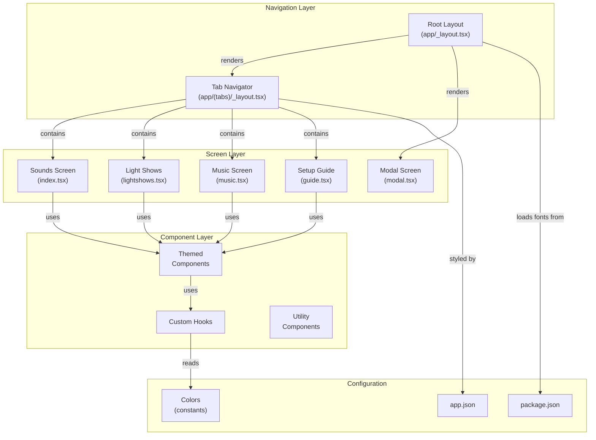

# Codebase Map: TeslaDrive

> Auto-generated by Cartographer. Last mapped: 2026-01-28

A React Native/Expo mobile application for managing Tesla USB drive content (lock sounds, boombox sounds, light shows, and music).

## System Overview



## Directory Structure

```
.
├── app/                          # Expo Router screens (file-based routing)
│   ├── _layout.tsx              # Root layout with theme & font loading
│   ├── (tabs)/                  # Tab group (bottom tab navigation)
│   │   ├── _layout.tsx          # Tab bar configuration
│   │   ├── index.tsx            # Sounds manager (lock + boombox)
│   │   ├── lightshows.tsx       # Light show manager
│   │   ├── music.tsx            # Music library manager
│   │   └── guide.tsx            # Setup guide & troubleshooting
│   ├── modal.tsx                # Modal screen template
│   ├── +html.tsx                # Web-specific HTML config
│   └── +not-found.tsx           # 404 error page
├── components/                  # Reusable components
│   ├── Themed.tsx               # Theme-aware Text/View wrappers
│   ├── StyledText.tsx           # Monospaced text component
│   ├── EditScreenInfo.tsx       # Dev info component
│   ├── ExternalLink.tsx         # Cross-platform link component
│   ├── useColorScheme.ts        # Color scheme hook (native)
│   ├── useColorScheme.web.ts    # Color scheme hook (web)
│   ├── useClientOnlyValue.ts    # Client value hook (native)
│   ├── useClientOnlyValue.web.ts # Client value hook (web)
│   └── __tests__/               # Component tests
├── constants/
│   └── Colors.ts                # Light/dark theme color definitions
├── assets/
│   ├── fonts/                   # Custom fonts (SpaceMono)
│   └── images/                  # App icons and splash
├── app.json                     # Expo configuration
├── package.json                 # Dependencies and scripts
├── tsconfig.json                # TypeScript configuration
└── CLAUDE.md                    # Development guide
```

## Module Guide

### Navigation & Layout

#### Root Layout (`app/_layout.tsx`)
- **Purpose**: Application entry point with font loading, theme provider, error boundaries
- **Key Exports**: `RootLayout` (component), `ErrorBoundary`, `unstable_settings` (route config)
- **Key Dependencies**: `@react-navigation/native`, `expo-font`, `expo-splash-screen`, `expo-router`
- **Responsibilities**:
  - Load SpaceMono and FontAwesome fonts before rendering
  - Apply system color scheme (light/dark)
  - Configure initial route as `(tabs)`
  - Manage splash screen visibility
  - Provide theme context via ThemeProvider
- **Tokens**: 360

#### Tab Layout (`app/(tabs)/_layout.tsx`)
- **Purpose**: Configure bottom tab navigation with 4 screens
- **Key Exports**: `TabLayout` (component)
- **Styling**:
  - Active tab: `#e94560` (pink/red)
  - Inactive tab: `#6c757d` (gray)
  - Background: `#1a1a2e` (dark)
  - Border: `#2d2d44`
- **Tabs** (in order):
  1. Sounds (musical-notes icon) → `index.tsx`
  2. Light Shows (flash icon) → `lightshows.tsx`
  3. Music (disc icon) → `music.tsx`
  4. Setup (book icon) → `guide.tsx`
- **Tokens**: 409

---

### Screen Components

#### Sounds Screen (`app/(tabs)/index.tsx`)
- **Purpose**: Manage Tesla lock sounds and boombox sounds with preview playback
- **Key Types**:
  ```typescript
  type SoundCategory = 'lock' | 'boombox';
  interface Sound {
    id: string;
    name: string;
    duration: string;
    category: string;
    isBuiltIn: boolean;
  }
  ```
- **Mock Data**: `BUNDLED_SOUNDS` - 10 placeholder sounds (royalty-free from Pixabay)
- **State**:
  - `activeCategory`: 'lock' | 'boombox' toggle
  - `selectedSound`: Currently selected sound ID
  - `isPlaying`: Playback status
- **UI Features**:
  - Category switcher buttons
  - Tesla requirements info banner
  - Scrollable sound list with play/pause controls
  - Empty state for imported sounds
  - Import/Export action buttons
- **TODO**: Implement audio playback with `expo-av`, file picker, USB export
- **Tokens**: 2308

#### Light Shows Screen (`app/(tabs)/lightshows.tsx`)
- **Purpose**: Import and manage Tesla light show files (.fseq + audio pairs)
- **Key Types**:
  ```typescript
  interface LightShow {
    id: string;
    name: string;
    artist: string;
    duration: string;
    source: 'imported' | 'online';
    hasFseq: boolean;
    hasAudio: boolean;
  }
  ```
- **Content**:
  - Empty imported shows array (placeholder)
  - Popular sources: Tesla Light Share, xLights Shows with external links
  - Step-by-step tutorial card
- **UI Features**:
  - .fseq + audio requirement info banner
  - External source links (opens in-app browser)
  - Show item cards with file status badges
  - Empty state guidance
- **TODO**: File import validation, paired file checking, USB export
- **Tokens**: 2495

#### Music Screen (`app/(tabs)/music.tsx`)
- **Purpose**: Music library management for Tesla USB playback
- **Key Types**:
  ```typescript
  interface MusicFile {
    id: string;
    name: string;
    artist: string;
    album: string;
    duration: string;
    size: string;
  }
  ```
- **Mock Data**: `IMPORTED_MUSIC` - Empty array (placeholder)
- **State**:
  - `selectedFiles`: Array of selected file IDs for batch operations
- **UI Features**:
  - Supported formats info banner (MP3, FLAC, AAC, OGG, WAV)
  - Stats bar (total tracks, selected count)
  - Select all / Deselect all toggle
  - Music item cards with checkboxes
  - Best practices tips card
  - Export button (conditional on selection)
- **TODO**: File import, metadata extraction, bulk USB export
- **Tokens**: 2381

#### Setup Guide Screen (`app/(tabs)/guide.tsx`)
- **Purpose**: Educational content about Tesla USB setup and troubleshooting
- **Key Types**:
  ```typescript
  interface GuideSection {
    id: string;
    title: string;
    icon: keyof typeof Ionicons.glyphMap;
    content: string[];
  }
  ```
- **Content** (9 expandable sections):
  1. Overview - Why two USB drives needed
  2. Hardware - Equipment and connections
  3. TeslaCam - Dashcam drive setup
  4. Media Drive - Media drive initialization
  5. Folder Structure - Directory organization
  6. Lock Sound - File specs (44.1kHz, WAV, 1MB max)
  7. Boombox - Multi-sound requirements
  8. Light Shows - .fseq + audio pairing
  9. Troubleshooting - Common issues and solutions
- **State**:
  - `expandedSections`: Array of expanded section IDs
  - Default: `['overview']` expanded
- **UI Features**:
  - Expand/Collapse all buttons
  - Welcome card with app intro
  - Collapsible sections with Ionicons
  - Support card at bottom
- **Tokens**: 2598

#### Modal Screen (`app/modal.tsx`)
- **Purpose**: Placeholder modal screen from Expo template
- **Use**: Template for future modal dialogs
- **Components**: Themed components, EditScreenInfo, StatusBar
- **Tokens**: 237

#### Not Found Screen (`app/+not-found.tsx`)
- **Purpose**: 404 error page when route not found
- **Features**: Link back to home, themed styling
- **Tokens**: 218

#### HTML Config (`app/+html.tsx`)
- **Purpose**: Web-specific HTML wrapper and styling
- **Features**: ScrollView reset, dark mode CSS, viewport meta tags
- **Environment**: Node.js only, no DOM
- **Tokens**: 312

---

### Component Layer

#### Themed Components (`components/Themed.tsx`)
- **Purpose**: Theme-aware wrappers for Text and View components
- **Key Exports**:
  - `Text`: Themed text component with color override props
  - `View`: Themed view component with color override props
  - `useThemeColor`: Hook for getting theme color based on color scheme
- **Props Pattern**:
  ```typescript
  interface ThemedTextProps extends TextProps {
    lightColor?: string;
    darkColor?: string;
  }
  ```
- **Usage**:
  ```typescript
  <Text lightColor="#000" darkColor="#fff">Content</Text>
  ```
- **Dependencies**: `Colors` constant, `useColorScheme` hook
- **Tokens**: 324

#### Styled Text (`components/StyledText.tsx`)
- **Purpose**: Monospaced text component using SpaceMono font
- **Key Exports**: `MonoText` - extends themed Text with fontFamily override
- **Use Case**: Code display, technical information
- **Tokens**: 45

#### External Link (`components/ExternalLink.tsx`)
- **Purpose**: Cross-platform link component with in-app browser support
- **Key Exports**: `ExternalLink` - link wrapper component
- **Behavior**:
  - Web: Opens in new tab
  - Native: Opens in expo-web-browser (in-app)
- **Dependencies**: `expo-web-browser`, `Platform`
- **Tokens**: 152

#### Edit Screen Info (`components/EditScreenInfo.tsx`)
- **Purpose**: Developer helper component (from Expo template)
- **Props**: `path` string for file path display
- **Components Used**: MonoText, Themed components, ExternalLink
- **Tokens**: 519

#### Color Scheme Hooks

**Native** (`components/useColorScheme.ts`)
- **Purpose**: Re-export React Native's useColorScheme hook
- **Platform**: iOS, Android
- **Returns**: 'light' | 'dark' | null
- **Tokens**: 11

**Web** (`components/useColorScheme.web.ts`)
- **Purpose**: Web-specific color scheme (returns static value)
- **Returns**: Always 'light' (no SSR support for dynamic color scheme)
- **Note**: Limitation of server rendering
- **Tokens**: 96

#### Client-Only Value Hooks

**Native** (`components/useClientOnlyValue.ts`)
- **Purpose**: Value rendering that bypasses SSR (always client value on native)
- **Type**: `<S, C>(server: S, client: C) => C`
- **Returns**: Client value directly (no server rendering on native)
- **Tokens**: 47

**Web** (`components/useClientOnlyValue.web.ts`)
- **Purpose**: SSR-safe value switching (server initially, client after hydration)
- **Type**: `<S, C>(server: S, client: C) => S | C`
- **Behavior**:
  - Initial render: `server`
  - After mount: Switches to `client` via useEffect
- **Prevents**: Hydration mismatches in server rendering
- **Tokens**: 95

#### Component Tests (`components/__tests__/StyledText-test.js`)
- **Purpose**: Snapshot test for MonoText component
- **Framework**: React Test Renderer
- **Tokens**: 61

---

### Configuration & Constants

#### Colors (`constants/Colors.ts`)
- **Purpose**: Centralized light/dark theme color definitions
- **Export**: Default object with two theme variations
- **Light Theme**:
  - text: `#000`
  - background: `#fff`
  - tint: `#2f95dc`
  - tabIconDefault: `#ccc`
  - tabIconSelected: `#2f95dc`
- **Dark Theme**:
  - text: `#fff`
  - background: `#000`
  - tint: `#fff`
  - tabIconDefault: `#ccc`
  - tabIconSelected: `#fff`
- **Note**: Main app screens use custom colors, not these
- **Tokens**: 107

#### Package Configuration (`package.json`)
- **App Name**: TeslaDrive
- **Version**: 1.0.0
- **Scripts**:
  - `start`: Expo development server
  - `ios`: iOS simulator launch
  - `android`: Android emulator launch
  - `web`: Web development server
- **Key Runtime Dependencies**:
  - `expo`: ~54.0.32 - Framework
  - `react`: 19.1.0 - UI library
  - `react-native`: 0.81.5 - Native layer
  - `expo-router`: ~6.0.22 - File-based routing
  - `expo-av`: ~16.0.8 - Audio playback (TODO)
  - `expo-document-picker`: ~14.0.8 - File import (TODO)
  - `expo-file-system`: ~19.0.21 - File operations (TODO)
  - `expo-sharing`: ~14.0.8 - USB export (TODO)
  - `@expo/vector-icons`: ^15.0.3 - Ionicons
  - `react-native-reanimated`: ~4.1.1 - Animations
  - `react-native-safe-area-context`: ~5.6.0 - Safe area
  - `react-native-screens`: ~4.16.0 - Navigation screens
  - `@react-navigation/native`: ^7.1.8 - Navigation
- **Dev Dependencies**: TypeScript 5.9.2, React Test Renderer
- **Tokens**: 420

#### Expo Configuration (`app.json`)
- **App Name**: TeslaDrive
- **Slug**: tesla-drive
- **Bundle IDs**:
  - iOS: `com.sioakim.tesladrive`
  - Android: `com.sioakim.tesladrive`
- **UI Settings**:
  - Orientation: Portrait only
  - User interface: Automatic (respects system theme)
  - New Architecture: Enabled
- **Splash Screen**:
  - Background: `#1a1a2e` (dark blue-gray)
  - Resize: Contain
- **Platform Features**:
  - iOS: Tablet support enabled
  - Android: Adaptive icon support
  - Web: Metro bundler, static output
- **Plugins**:
  - expo-router (file-based routing)
  - expo-splash-screen (with custom image)
- **Experiments**: Typed routes enabled
- **Tokens**: 322

#### TypeScript Configuration (`tsconfig.json`)
- **Extends**: expo/tsconfig.base
- **Compiler Options**:
  - `strict: true` - Full type safety
  - Path alias: `@/*` → root directory
- **Include**: All .ts/.tsx files, Expo types
- **Tokens**: 75

---

## Data Structures & Mock Data

### Sounds Data Model
```typescript
interface Sound {
  id: string;
  name: string;
  duration: string;
  category: string;
  isBuiltIn: boolean;
}

const BUNDLED_SOUNDS: Sound[] = [
  { id: '1', name: 'Digital Chime', duration: '0:02', category: 'chime', isBuiltIn: true },
  { id: '2', name: 'Sci-Fi Beep', duration: '0:01', category: 'sci-fi', isBuiltIn: true },
  // ... 10 total (royalty-free from Pixabay)
];
```

### Light Shows Data Model
```typescript
interface LightShow {
  id: string;
  name: string;
  artist: string;
  duration: string;
  source: 'imported' | 'online';
  hasFseq: boolean;
  hasAudio: boolean;
}

const IMPORTED_SHOWS: LightShow[] = []; // Placeholder
```

### Music Data Model
```typescript
interface MusicFile {
  id: string;
  name: string;
  artist: string;
  album: string;
  duration: string;
  size: string;
}

const IMPORTED_MUSIC: MusicFile[] = []; // Placeholder
```

### Guide Data Model
```typescript
interface GuideSection {
  id: string;
  title: string;
  icon: keyof typeof Ionicons.glyphMap;
  content: string[];
}
```

---

## Styling & Theme System

### Custom Dark Theme (Screens)
Screens use a custom dark color palette:
- **Very Dark Background**: `#0f0f1a`
- **Card/Section Background**: `#1a1a2e`
- **Border Color**: `#2d2d44`
- **Primary Accent**: `#e94560` (pink/red)
- **Success Color**: `#16c79a` (teal)
- **Primary Text**: `#ffffff`
- **Secondary Text**: `#adb5bd` (light gray)
- **Tertiary Text**: `#6c757d` (gray)

### StyleSheet Patterns
- `StyleSheet.create()` for performance optimization
- Inline styles only for dynamic/computed values
- Consistent spacing via `gap` property
- Border radius: 8-16px (modern design)
- Platform-specific overrides: `Platform.select()`

### Component Theming (Legacy)
- `Themed.tsx` provides light/dark component variants
- Used primarily in modal and 404 screens
- Offers `lightColor` and `darkColor` props for overrides

---

## Platform-Specific Implementations

### Web
- **File**: `app/+html.tsx` - Custom HTML root
- **Hooks**: `useColorScheme.web.ts` (static 'light'), `useClientOnlyValue.web.ts` (SSR-safe)
- **Build**: Metro bundler, static output directory
- **Limitations**: No system color scheme detection due to SSR

### iOS
- **Bundle ID**: `com.sioakim.tesladrive`
- **Features**: Tablet support enabled, custom status bar colors
- **Tab Bar**: Platform-specific styling in _layout.tsx
- **SafeArea**: Via `react-native-safe-area-context`

### Android
- **Package**: `com.sioakim.tesladrive`
- **Icon**: Adaptive icon with `#1a1a2e` background
- **Features**: Same as iOS, consistent UI

---

## Component Hierarchy

```
RootLayout (app/_layout.tsx)
  ├── ThemeProvider (dark/light)
  └── Stack Navigator
      ├── TabLayout (app/(tabs)/_layout.tsx)
      │   ├── Sounds Screen (index.tsx)
      │   │   ├── Themed.Text & View
      │   │   ├── ScrollView
      │   │   ├── FlatList (sounds)
      │   │   └── Ionicons
      │   ├── Light Shows Screen (lightshows.tsx)
      │   │   ├── Themed components
      │   │   ├── ExternalLink (sources)
      │   │   └── Ionicons
      │   ├── Music Screen (music.tsx)
      │   │   ├── Themed components
      │   │   ├── FlatList (music)
      │   │   └── Checkbox controls
      │   └── Guide Screen (guide.tsx)
      │       ├── Themed components
      │       ├── FlatList (sections)
      │       └── Expandable sections
      └── Modal Screen (modal.tsx)
          ├── Themed components
          └── EditScreenInfo
```

---

## Dependency Graph

### Internal Dependencies

**Root Layout**:
- → All screens (via Stack and Tabs)
- ← Uses: useColorScheme, FontAwesome font

**Tab Layout**:
- → All four screens
- ← Uses: Ionicons, Platform

**Screen Dependencies**:
- index.tsx → Themed, Ionicons
- lightshows.tsx → Themed, Ionicons, ExternalLink
- music.tsx → Themed, Ionicons
- guide.tsx → Themed, Ionicons
- modal.tsx → Themed, EditScreenInfo

**Component Dependencies**:
- Themed → useColorScheme, Colors
- EditScreenInfo → Themed, MonoText, ExternalLink
- ExternalLink → expo-web-browser, Platform
- MonoText → Themed (Text)

### External Dependencies by Feature

**Navigation**:
- expo-router (file-based routing)
- @react-navigation/native (themes)

**UI & Icons**:
- @expo/vector-icons/Ionicons
- react-native-safe-area-context
- react-native-screens

**Media (TODO)**:
- expo-av (audio playback)
- expo-document-picker (file import)
- expo-file-system (file management)
- expo-sharing (USB export)

**Utilities**:
- expo-font (custom fonts)
- expo-splash-screen (loading screen)
- expo-web-browser (in-app browser links)
- expo-linking (deep links)

---

## Implementation Status

### ✅ Completed
- Tab navigation structure (4 screens)
- Screen layouts and basic UI
- Theme system with dark-first design
- Platform-specific configurations
- Mock data with proper TypeScript types
- Comprehensive setup guide
- Icon integration (Ionicons)
- Font loading system

### 🚧 TODO (Scaffolded, Not Implemented)
1. **Audio Playback** - expo-av integration for sound preview
2. **File Import** - expo-document-picker integration
3. **USB Export** - expo-file-system + expo-sharing for exporting to USB
4. **Audio Conversion** - WAV format conversion (44.1kHz, <1MB)
5. **File Validation** - Light show .fseq + audio pairing, audio specs
6. **Metadata Extraction** - Music file metadata (artist, album, duration)
7. **Persistent Storage** - AsyncStorage or SQLite for imported files
8. **Folder Structure Creation** - Automatic USB folder organization

---

## Key Development Patterns

1. **File-Based Routing**: Expo Router automatically creates routes from `app/` structure
2. **Platform Abstraction**: `.web.ts`, `.native.ts` extensions for platform-specific code
3. **TypeScript First**: Full strict mode, interfaces for all data models
4. **Themed Components**: Dark/light mode via component wrappers + hooks
5. **Mock-First Development**: Placeholder data enables UI development without backend
6. **Empty States**: User guidance when lists are empty
7. **Educational UX**: Extensive guide for users unfamiliar with Tesla USB setup
8. **Responsive Layout**: Adapts to different screen sizes and orientations
9. **Icon System**: Ionicons for consistent cross-platform icons
10. **Separation of Concerns**: Config, constants, components, and screens clearly separated

---

## Navigation Quick Reference

### Tab Routes
- **Sounds** → `app/(tabs)/index.tsx` (default route)
- **Light Shows** → `app/(tabs)/lightshows.tsx`
- **Music** → `app/(tabs)/music.tsx`
- **Setup Guide** → `app/(tabs)/guide.tsx`

### Other Routes
- **Modal** → `app/modal.tsx`
- **404** → `app/+not-found.tsx`
- **Root HTML** → `app/+html.tsx`

---

## File Reference by Category

| File | Lines | Tokens | Purpose |
|------|-------|--------|---------|
| `app/(tabs)/guide.tsx` | 357 | 2598 | Setup guide (largest) |
| `app/(tabs)/lightshows.tsx` | 373 | 2495 | Light show manager |
| `app/(tabs)/music.tsx` | 361 | 2381 | Music library |
| `app/(tabs)/index.tsx` | 324 | 2308 | Sounds manager |
| `CLAUDE.md` | - | 1315 | Development guide |
| `README.md` | - | 1024 | Project documentation |
| `package.json` | - | 420 | Dependencies |
| `app/(tabs)/_layout.tsx` | 69 | 409 | Tab navigation |
| `app/_layout.tsx` | 59 | 360 | Root layout |
| `components/EditScreenInfo.tsx` | 77 | 519 | Dev info |
| `components/Themed.tsx` | 45 | 324 | Theme wrapper |
| `components/useClientOnlyValue.web.ts` | - | 95 | SSR-safe values |
| `components/useColorScheme.web.ts` | - | 96 | Web theme |
| `app.json` | - | 322 | Expo config |
| `app/modal.tsx` | 35 | 237 | Modal template |
| `app/+not-found.tsx` | 40 | 218 | 404 screen |
| `components/ExternalLink.tsx` | 24 | 152 | Link component |
| `constants/Colors.ts` | - | 107 | Color palette |
| `components/useClientOnlyValue.ts` | - | 47 | Native values |
| `components/StyledText.tsx` | - | 45 | Mono text |
| `tsconfig.json` | - | 75 | TypeScript config |
| `components/useColorScheme.ts` | - | 11 | Native theme |

**Total**: 28 files, 16,341 tokens
